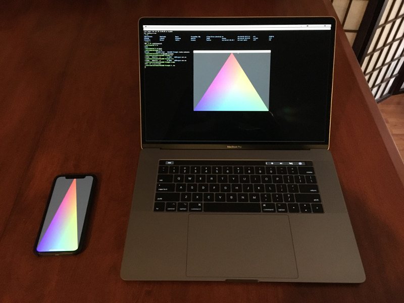

# Metal02-Triangle
Rasterizing a triangle to the screen using Metal.

# Building

## macOS

Type `make` at project root. Xcode command line utilities are the only dependency.

Requires 10.13.

## iOS

Use the provided Xcode project. An active Apple developer account is required to build the example for a target device.
